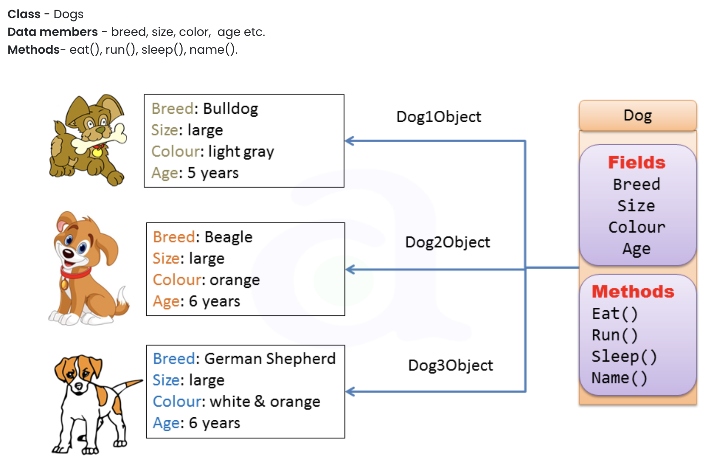

# Java-Assignment-010 - Classes and Objects


## Part 1 - Analyze
* Add Comments to the Code below and label the following:
  1. Class name
  2. All **instance variables/fields** and their data-types
  3. The **Constructor** and the **Constructor Parameters**
  4. Where a **Student** object gets created.
  5. Where the **instance variables** value gets set and what its values are.
  6. All the instance methods for the class **Student**

```java
/**
 * Author Sequoyah Schaefer
 * Since 4/17/2023
 * Version 1.0
 */
class Student{  /** Class: Student */
    private String name; /** Instance Variable 1: Name, String. Variable 2 rollNo, int.*/
    private int rollNo;
   
    Student(String s, int r) /** Constructor: Student Parameters: String s, int r.*/
    {
   	    
        name = s; /** Instance variables set here. Name value is S and rollNo value is r.*/
   	    rollNo = r;
    }
   
    void methodForDisplay()
    {
        System.out.println(name+"'s Roll No: "+rollNo);
    }

    public static void main(String[] args) {
        Student obj1=new Student("Rambo",21); /** Student object is created by the constructor.*/
        obj1.methodForDisplay();
    }
}
```

## Part 2 - Public VS Static

* Read the W3Schools page on class methods: [W3Schools Java Class Methods](https://www.w3schools.com/java/java_class_methods.asp)
* In your own words, write a few sentences below explaining the difference between static and public methods in relation to a class.
Java programs usually have either static or public attributes and methods. 
* For the example of 
* public class Main {
  static void myMethod() {
  System.out.println("Hello World!");
  }

  public static void main(String[] args) {
  myMethod();
  }
  }

// Outputs "Hello World!" ,
this is a static method. This means it can be accessed without creating an object of the class, whereas public can only be accessed by objects. 
For
Main myObj = new Main();
myObj.myPublicMethod();
This is a public method, the object is first created from Main and then it is called in the second line. 

## Part 3 - Dogs

* View the image below, and from the image, construct a Java file **Dog** that mirrors the diagrammed class and the 3 dog objects.


* Your class should be named **Dog**
* You should have **private** instance variables/fields for all the data members.
* You should have a **constructor** that sets the initial state of the data members via passed parameters.
    * Think about what data-types the fields and parameters will need!!!
* You should have 4 instance methods for eat, run, sleep, and name
* You should have a **main** method that creates the 3 Dog objects in the diagram.
* Make at least 2 of your methods functional (i.e. perform some action)!!!
    * For Example: method eat might take a class parameter named **Food** (i.e. another class) that has a field **weight**, and your eat method might reduce the weight in **Food**.

## Part 4 - Turn-In

* Commit your code and push it back to your account.
* Create a Pull request as you have been doing for all assignments.
* Paste the Pull request URL back into the Canvass assignment page for credit.
